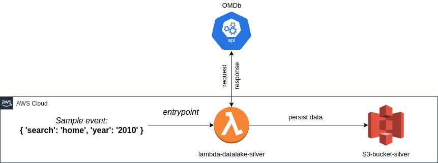

# Data Lake Silver Layer

> The purpose of this project is to prepare a study environment.

This project gives you an **AWS Lambda** function in manual execution mode to request unstructured data from [OMDb API](http://www.omdbapi.com/)
and persist on AWS S3 storage.
Additionally, the project uses the [serverless-python-requirements](https://github.com/UnitedIncome/serverless-python-requirements) for the [Serverless Framework](https://www.serverless.com/), with the purpose of dealing with Python packaging on AWS Lambda.

This project is the first step of the ingestion pipeline study. The last one is [Data Lake Gold Layer](https://github.com/fillipevieira/lambda-datalake-gold)  

## Tech Stack
- Infra

| Component                      | Version              |
| --------------------           | -------------------- |
| AWS Lambda                     |           -          |
| AWS S3                         |           -          |
| serverless-python-requirements | 5.1.0                |

- Languages

| Python |
| ------ |
| 3.7.9  |

- Apps

| Component      |
| -------------- |
| OMDb API       |
